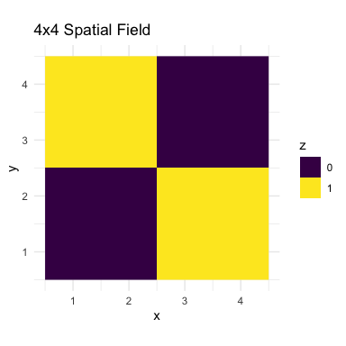
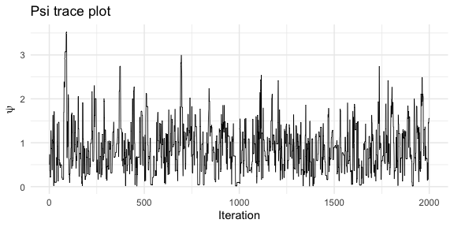
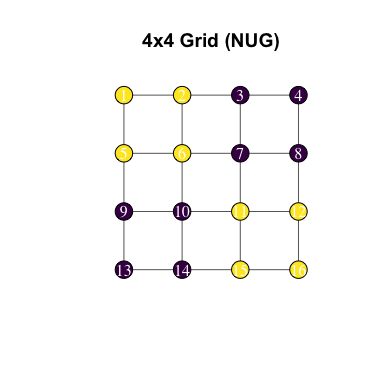
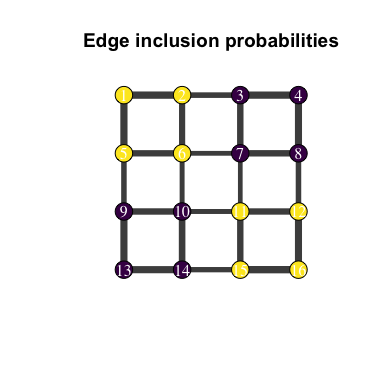

<!-- README.md is generated from README.Rmd. Please edit that file -->

# mdgm

<!-- badges: start -->

<!-- badges: end -->

**mdgm** (Mixture of Directed Graphical Models) provides Bayesian
inference for discrete spatial random fields. Instead of working with a
Markov random field and its intractable normalizing constant, the MDGM
defines a mixture over directed acyclic graphs (DAGs) compatible with an
undirected neighborhood graph. Each DAG admits a tractable likelihood,
avoiding the partition function entirely.

See [Carter and Calder (2024)](https://arxiv.org/abs/2406.15700) for the
full methodological details.

## Installation

You can install the development version from GitHub:

``` r
# install.packages("pak")
pak::pak("jbcart/mdgm")
```

A C++20 compiler is required.

## Quick start

``` r
library(mdgm)

# Build a 4x4 grid graph with rook adjacency
nug <- nug_from_grid(4, 4, seed = 42L)
nug$nvertices()
#> [1] 16
nug$nedges()
#> [1] 24
```

## Fitting a standalone model

In a standalone model, the spatial field $z$ is observed directly — no
emission distribution is needed. Here we fit a spanning-tree MDGM to a
deterministic checkerboard pattern on the 4x4 grid:

``` r
# Define the spatial field
z <- c(1L, 1L, 0L, 0L,
       1L, 1L, 0L, 0L,
       0L, 0L, 1L, 1L,
       0L, 0L, 1L, 1L)

# Specify a standalone model (no emission)
model <- mdgm_model(nug, dag_type = "spanning_tree")

# Run MCMC
result <- mcmc(model, z_init = z, psi_init = 0.5,
               n_iter = 2000L, psi_tune = 1.0, seed = 42L)
result$summary()
#> MDGM MCMC Results
#>   Vertices: 16, Colors: 2
#>   Iterations: 2000
#>   Psi acceptance rate: 0.471
#>   Psi posterior mean: 0.8673
```

Visualize the spatial field as a raster:

``` r
library(ggplot2)

grid_df <- data.frame(
  x = rep(1:4, times = 4),
  y = rep(4:1, each = 4),
  z = factor(z)
)

ggplot(grid_df, aes(x, y, fill = z)) +
  geom_raster() +
  scale_fill_manual(values = c("0" = "#440154", "1" = "#fde725")) +
  coord_equal() +
  theme_minimal() +
  labs(title = "4x4 Spatial Field", fill = "z")
```



Trace plot for the spatial dependence parameter $\psi$:

``` r
psi_df <- data.frame(iteration = seq_along(result$psi()), psi = result$psi())

ggplot(psi_df, aes(iteration, psi)) +
  geom_line(linewidth = 0.3) +
  theme_minimal() +
  labs(x = "Iteration", y = expression(psi), title = "Psi trace plot")
```



## Visualizing graph structure with igraph

The [igraph](https://r.igraph.org/) package (suggested, not required)
can plot the neighborhood graph. First, the raw grid:

``` r
library(igraph)
#> 
#> Attaching package: 'igraph'
#> The following objects are masked from 'package:stats':
#> 
#>     decompose, spectrum
#> The following object is masked from 'package:base':
#> 
#>     union

# Build igraph object from the NUG edge structure
n <- nug$nvertices()
el <- do.call(rbind, lapply(1:n, function(v) {
  nbrs <- nug$neighbors(v)
  nbrs <- nbrs[nbrs > v]
  if (length(nbrs) == 0) return(NULL)
  cbind(v, nbrs)
}))
g <- graph_from_edgelist(el, directed = FALSE)

# Grid layout
coords <- cbind((seq_len(n) - 1) %% 4 + 1, 4 - (seq_len(n) - 1) %/% 4)

plot(g, layout = coords, vertex.size = 20, vertex.label = 1:n,
     vertex.color = c("#440154", "#fde725")[z + 1],
     vertex.label.color = "white", edge.color = "grey40",
     main = "4x4 Grid (NUG)")
```



## Edge inclusion probabilities

The `edge_inclusion_probs()` method counts how often each undirected
edge appears in the posterior spanning-tree samples. We can use these
proportions to scale edge widths:

``` r
eip <- result$edge_inclusion_probs(nug, burnin = 200L)
head(eip[order(-eip$prob), ])
#>    vertex1 vertex2      prob
#> 24      15      16 0.7338889
#> 1        1       2 0.7322222
#> 5        3       4 0.7255556
#> 2        1       5 0.7194444
#> 22      13      14 0.7150000
#> 16       9      13 0.7127778

# Match edge inclusion probs to igraph edge ordering
edge_probs <- numeric(ecount(g))
for (i in seq_len(nrow(eip))) {
  eid <- get.edge.ids(g, c(eip$vertex1[i], eip$vertex2[i]))
  edge_probs[eid] <- eip$prob[i]
}
#> Warning: `get.edge.ids()` was deprecated in igraph 2.1.0.
#> ℹ Please use `get_edge_ids()` instead.
#> This warning is displayed once every 8 hours.
#> Call `lifecycle::last_lifecycle_warnings()` to see where this warning was
#> generated.

plot(g, layout = coords, vertex.size = 20, vertex.label = 1:n,
     vertex.color = c("#440154", "#fde725")[z + 1],
     vertex.label.color = "white",
     edge.width = edge_probs * 10,
     edge.color = "grey30",
     main = "Edge inclusion probabilities")
```



## C++ unit tests

The C++ core ships with GoogleTest unit tests under `tests/cpp/`. Build
and run them with:

``` bash
cmake -B build -DBUILD_TESTS=ON
cmake --build build
ctest --test-dir build
```
