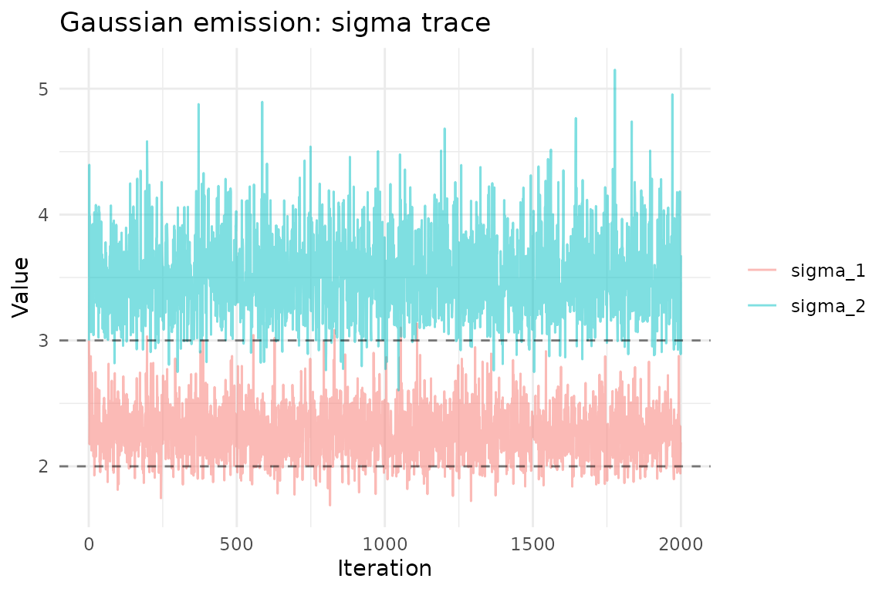

# Emission Models

``` r
library(mdgm)
library(ggplot2)
```

## Overview

In a hierarchical MDGM, the spatial field $z$ is latent and observations
$y$ are generated through an **emission distribution**. The mdgm package
supports three emission families:

| Family    | Observation type            | Parameters                       | Prior                 |
|:----------|:----------------------------|:---------------------------------|:----------------------|
| Bernoulli | Binary (0/1)                | $\eta_{k}$ (success probability) | Beta$(a,b)$           |
| Gaussian  | Continuous (integer-valued) | $\mu_{k}$, $\sigma_{k}$          | Normal-InverseGamma   |
| Poisson   | Count                       | $\lambda_{k}$ (rate)             | Gamma$(\alpha,\beta)$ |

All emission families enforce an **identifiability constraint** on their
location parameters: $\eta_{0} < \eta_{1} < \cdots$ (Bernoulli),
$\mu_{0} < \mu_{1} < \cdots$ (Gaussian), or
$\lambda_{0} < \lambda_{1} < \cdots$ (Poisson). This is achieved via
truncated conjugate posterior sampling.

## Bernoulli emission

The Bernoulli emission models binary observations. Each vertex $i$ can
have multiple replicate observations $y_{i1},\ldots,y_{im_{i}}$, each
drawn independently from $\text{Bernoulli}\left( \eta_{z_{i}} \right)$.

### Example: binary disease indicators on a grid

``` r
nug <- nug_from_grid(6, 6, seed = 42L)
n <- nug$nvertices()
```

Simulate a latent field and binary observations:

``` r
set.seed(1)
# True latent field: left half = 0, right half = 1
z_true <- rep(0:1, each = n / 2)

# True emission probabilities
eta_true <- c(0.2, 0.8)

# 5 replicate observations per vertex
y <- lapply(seq_len(n), function(i) {
  rbinom(5, 1, eta_true[z_true[i] + 1])
})
```

Fit the model:

``` r
model <- mdgm_model(nug, dag_type = "spanning_tree",
                     n_colors = 2L, emission = "bernoulli")

result <- mcmc(model, y = y,
               z_init = sample(0:1, n, replace = TRUE),
               psi_init = 0.5,
               eta_init = c(0.3, 0.7),
               n_iter = 2000L,
               psi_tune = 1.0,
               emission_prior_params = c(1, 1),
               seed = 42L,
               nug = nug)

result$summary(burnin = 500L)
#> MDGM MCMC Results
#>   Vertices: 36, Colors: 2
#>   Iterations: 2000 (burnin: 500)
#>   Psi acceptance rate: 0.650
#>   Psi posterior mean: 3.1057 (sd: 1.1578)
#>   Emission type: bernoulli
#>   eta_1 posterior mean: 0.1606 (sd: 0.0400)
#>   eta_2 posterior mean: 0.8197 (sd: 0.0401)
#>   Psi R-hat: 1.0025, ESS: 91
```

### Posterior trace plots

``` r
ep <- result$emission_params()
eta_df <- data.frame(
  iteration = rep(1:2000, 2),
  value = c(ep$eta[1, ], ep$eta[2, ]),
  parameter = rep(c("eta_1", "eta_2"), each = 2000)
)

ggplot(eta_df, aes(iteration, value, color = parameter)) +
  geom_line(alpha = 0.5) +
  geom_hline(yintercept = eta_true, linetype = "dashed", alpha = 0.5) +
  theme_minimal() +
  labs(title = "Bernoulli emission: eta trace",
       x = "Iteration", y = "Value", color = NULL)
```


## Gaussian emission

The Gaussian emission models continuous (integer-valued) observations.
Each observation is drawn from
$\mathcal{N}\left( \mu_{z_{i}},\sigma_{z_{i}}^{2} \right)$.

The prior is a Normal-InverseGamma:
$\mu_{k} \mid \sigma_{k}^{2} \sim \mathcal{N}\left( \mu_{0},\sigma_{k}^{2}/\kappa_{0} \right)$
and
$\sigma_{k}^{2} \sim \text{InverseGamma}\left( \alpha_{0},\beta_{0} \right)$.

### Example: spatial temperature field

``` r
nug_g <- nug_from_grid(6, 6, seed = 42L)
n_g <- nug_g$nvertices()

set.seed(2)
# Two spatial clusters: cold (left) and warm (right)
z_true_g <- rep(0:1, each = n_g / 2)
mu_true <- c(10, 25)
sigma_true <- c(2, 3)

# 3 replicate observations per vertex (rounded to integers for storage)
y_g <- lapply(seq_len(n_g), function(i) {
  as.integer(round(rnorm(3, mu_true[z_true_g[i] + 1],
                         sigma_true[z_true_g[i] + 1])))
})
```

Fit with Gaussian emission:

``` r
model_g <- mdgm_model(nug_g, dag_type = "spanning_tree",
                       n_colors = 2L, emission = "gaussian")

# eta_init: c(mu_1, mu_2, sigma_1, sigma_2)
result_g <- mcmc(model_g, y = y_g,
                 z_init = sample(0:1, n_g, replace = TRUE),
                 psi_init = 0.5,
                 eta_init = c(12, 22, 3, 3),
                 n_iter = 2000L,
                 psi_tune = 1.0,
                 emission_prior_params = c(0, 0.01, 2, 1),
                 seed = 42L,
                 nug = nug_g)

result_g$summary(burnin = 500L)
#> MDGM MCMC Results
#>   Vertices: 36, Colors: 2
#>   Iterations: 2000 (burnin: 500)
#>   Psi acceptance rate: 0.644
#>   Psi posterior mean: 3.2391 (sd: 1.0457)
#>   Emission type: gaussian
#>   mu_1 posterior mean: 10.2123 (sd: 0.3045)
#>   sigma_1 posterior mean: 24.7006 (sd: 0.4767)
#>   NA posterior mean: 2.2668 (sd: 0.2140)
#>   NA posterior mean: 3.5253 (sd: 0.3376)
#>   Psi R-hat: 0.9999, ESS: 156
```

### Posterior emission parameters

``` r
ep_g <- result_g$emission_params()

mu_df <- data.frame(
  iteration = rep(1:2000, 2),
  value = c(ep_g$mu[1, ], ep_g$mu[2, ]),
  parameter = rep(c("mu_1", "mu_2"), each = 2000)
)

ggplot(mu_df, aes(iteration, value, color = parameter)) +
  geom_line(alpha = 0.5) +
  geom_hline(yintercept = mu_true, linetype = "dashed", alpha = 0.5) +
  theme_minimal() +
  labs(title = "Gaussian emission: mu trace",
       x = "Iteration", y = "Value", color = NULL)
```


``` r
sigma_df <- data.frame(
  iteration = rep(1:2000, 2),
  value = c(ep_g$sigma[1, ], ep_g$sigma[2, ]),
  parameter = rep(c("sigma_1", "sigma_2"), each = 2000)
)

ggplot(sigma_df, aes(iteration, value, color = parameter)) +
  geom_line(alpha = 0.5) +
  geom_hline(yintercept = sigma_true, linetype = "dashed", alpha = 0.5) +
  theme_minimal() +
  labs(title = "Gaussian emission: sigma trace",
       x = "Iteration", y = "Value", color = NULL)
```



## Poisson emission

The Poisson emission models count data. Each observation is drawn from
$\text{Poisson}\left( \lambda_{z_{i}} \right)$.

The prior is a Gamma distribution:
$\lambda_{k} \sim \text{Gamma}\left( \alpha_{0},\beta_{0} \right)$ with
rate parameterization (mean $= \alpha_{0}/\beta_{0}$).

### Example: spatial species counts

``` r
nug_p <- nug_from_grid(6, 6, seed = 42L)
n_p <- nug_p$nvertices()

set.seed(3)
# Two habitats: sparse (left) and abundant (right)
z_true_p <- rep(0:1, each = n_p / 2)
lambda_true <- c(2, 10)

# 4 replicate counts per vertex
y_p <- lapply(seq_len(n_p), function(i) {
  as.integer(rpois(4, lambda_true[z_true_p[i] + 1]))
})
```

Fit with Poisson emission:

``` r
model_p <- mdgm_model(nug_p, dag_type = "spanning_tree",
                       n_colors = 2L, emission = "poisson")

result_p <- mcmc(model_p, y = y_p,
                 z_init = sample(0:1, n_p, replace = TRUE),
                 psi_init = 0.5,
                 eta_init = c(3, 8),
                 n_iter = 2000L,
                 psi_tune = 1.0,
                 emission_prior_params = c(1, 0.1),
                 seed = 42L,
                 nug = nug_p)

result_p$summary(burnin = 500L)
#> MDGM MCMC Results
#>   Vertices: 36, Colors: 2
#>   Iterations: 2000 (burnin: 500)
#>   Psi acceptance rate: 0.664
#>   Psi posterior mean: 3.3126 (sd: 1.1022)
#>   Emission type: poisson
#>   lambda_1 posterior mean: 1.7821 (sd: 0.1595)
#>   lambda_2 posterior mean: 9.6655 (sd: 0.3693)
#>   Psi R-hat: 1.0010, ESS: 110
```

### Posterior trace plots

``` r
ep_p <- result_p$emission_params()

lambda_df <- data.frame(
  iteration = rep(1:2000, 2),
  value = c(ep_p$lambda[1, ], ep_p$lambda[2, ]),
  parameter = rep(c("lambda_1", "lambda_2"), each = 2000)
)

ggplot(lambda_df, aes(iteration, value, color = parameter)) +
  geom_line(alpha = 0.5) +
  geom_hline(yintercept = lambda_true, linetype = "dashed", alpha = 0.5) +
  theme_minimal() +
  labs(title = "Poisson emission: lambda trace",
       x = "Iteration", y = "Value", color = NULL)
```


## Comparing latent field recovery

For all three emission types, the posterior mode of the latent field
should recover the true spatial pattern. Here we compare using the
Poisson example:

``` r
burnin <- 500L
z_post <- result_p$z()
z_post_burn <- z_post[, (burnin + 1):ncol(z_post)]

# Posterior mode per vertex
z_mode <- apply(z_post_burn, 1, function(row) {
  tbl <- tabulate(row + 1L, nbins = 2)
  which.max(tbl) - 1L
})

field_df <- data.frame(
  x = rep(1:6, 6),
  y = rep(6:1, each = 6),
  value = c(z_true_p, z_mode),
  panel = rep(c("True field", "Posterior mode"), each = n_p)
)
field_df$panel <- factor(field_df$panel, levels = c("True field", "Posterior mode"))

ggplot(field_df, aes(x, y, fill = factor(value))) +
  geom_tile() +
  scale_fill_viridis_d() +
  coord_equal() +
  facet_wrap(~panel) +
  theme_minimal() +
  labs(fill = "z")
```


## Choosing an emission family

| Scenario                                             | Recommended emission |
|:-----------------------------------------------------|:---------------------|
| Binary outcomes (presence/absence, success/failure)  | `"bernoulli"`        |
| Continuous measurements (temperature, concentration) | `"gaussian"`         |
| Count data (species counts, event counts)            | `"poisson"`          |

## Prior tuning tips

- **Bernoulli** `c(a, b)`: Use `c(1, 1)` (uniform) as a default.
  Increase `a` and `b` to shrink $\eta_{k}$ toward 0.5 if you expect
  weak signal.
- **Gaussian** `c(mu_0, kappa_0, alpha_0, beta_0)`: Set `mu_0` near the
  data mean, `kappa_0` small (e.g., 0.01) for weak location prior, and
  `alpha_0 = 2`, `beta_0` near the expected variance for a weakly
  informative scale prior.
- **Poisson** `c(alpha_0, beta_0)`: The prior mean is
  `alpha_0 / beta_0`. Use `c(1, 0.1)` for a diffuse prior with mean 10,
  or match to the expected count range.
