# Emission Models

``` r
library(mdgm)
library(ggplot2)
```

## Overview

In a hierarchical MDGM, the spatial field $z$ is latent and observations
$y$ are generated through an **emission distribution**. The mdgm package
supports three emission families:

| Family    | Observation type | Parameters                    | Prior                             |
|:----------|:-----------------|:------------------------------|:----------------------------------|
| Bernoulli | Binary (0/1)     | $p_{k}$ (success probability) | Beta$(a,b)$                       |
| Gaussian  | Continuous       | $\mu_{k}$, $\sigma_{k}^{2}$   | Independent Normal, Inverse-Gamma |
| Poisson   | Count            | $\lambda_{k}$ (rate)          | Gamma$(\alpha,\beta)$             |

All emission families enforce an **identifiability constraint** on their
location parameters: $p_{0} < p_{1} < \cdots$ (Bernoulli),
$\mu_{0} < \mu_{1} < \cdots$ (Gaussian), or
$\lambda_{0} < \lambda_{1} < \cdots$ (Poisson). This is achieved via
truncated conjugate posterior sampling.

## Simulating a spatial field

For the examples below we use a simple region-growing algorithm to
generate irregular spatial clusters on a grid graph. Starting from
random seed vertices, regions expand outward one cell at a time,
producing blocky but asymmetric patterns:

``` r
grow_regions <- function(nug, n_colors, seed = NULL) {
  if (!is.null(seed)) set.seed(seed)
  n <- nug$nvertices()
  z <- rep(NA_integer_, n)

  # Plant one seed per color
  seeds <- sample(n, n_colors)
  for (k in seq_along(seeds)) z[seeds[k]] <- k - 1L

  # Grow: repeatedly claim a random unclaimed neighbor
  repeat {
    boundary <- which(!is.na(z))
    candidates <- integer(0)
    for (v in boundary) {
      nbrs <- nug$neighbors(v)
      candidates <- c(candidates, nbrs[is.na(z[nbrs])])
    }
    candidates <- unique(candidates)
    if (length(candidates) == 0) break

    pick <- sample(candidates, 1)
    claimed <- nug$neighbors(pick)
    claimed <- claimed[!is.na(z[claimed])]
    z[pick] <- z[sample(claimed, 1)]
  }
  z
}
```

``` r
nug <- nug_from_grid(8, 8, seed = 42L)
n <- nug$nvertices()

z_true <- grow_regions(nug, n_colors = 2, seed = 28)

grid_df <- data.frame(
  x = rep(1:8, 8), y = rep(8:1, each = 8),
  z = factor(z_true)
)
ggplot(grid_df, aes(x, y, fill = z)) +
  geom_tile(color = "white", linewidth = 0.3) +
  scale_fill_manual(values = c("0" = "#440154", "1" = "#fde725")) +
  coord_equal() + theme_minimal() +
  labs(title = "Simulated spatial field (region growing)", fill = "z")
```

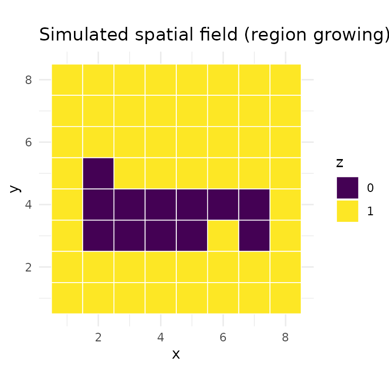

## Bernoulli emission

The Bernoulli emission models binary observations. Each vertex $i$ can
have multiple replicate observations $y_{i1},\ldots,y_{im_{i}}$, each
drawn independently from $\text{Bernoulli}\left( p_{z_{i}} \right)$.
Multiple replicates per vertex are needed for identifiability in the
Bernoulli case.

### Example: binary indicators on a grid

``` r
set.seed(1)
p_true <- c(0.3, 0.7)

# 5 replicate observations per vertex
y_bern <- lapply(seq_len(n), function(i) {
  rbinom(5, 1, p_true[z_true[i] + 1])
})

# Visualize average response per vertex
obs_df_b <- data.frame(
  x = rep(1:8, 8), y = rep(8:1, each = 8),
  value = vapply(y_bern, mean, numeric(1))
)
ggplot(obs_df_b, aes(x, y, fill = value)) +
  geom_tile(color = "white", linewidth = 0.3) +
  scale_fill_gradient(low = "#440154", high = "#fde725") +
  coord_equal() + theme_minimal() +
  labs(title = "Average observed response (5 replicates)", fill = expression(bar(y)))
```

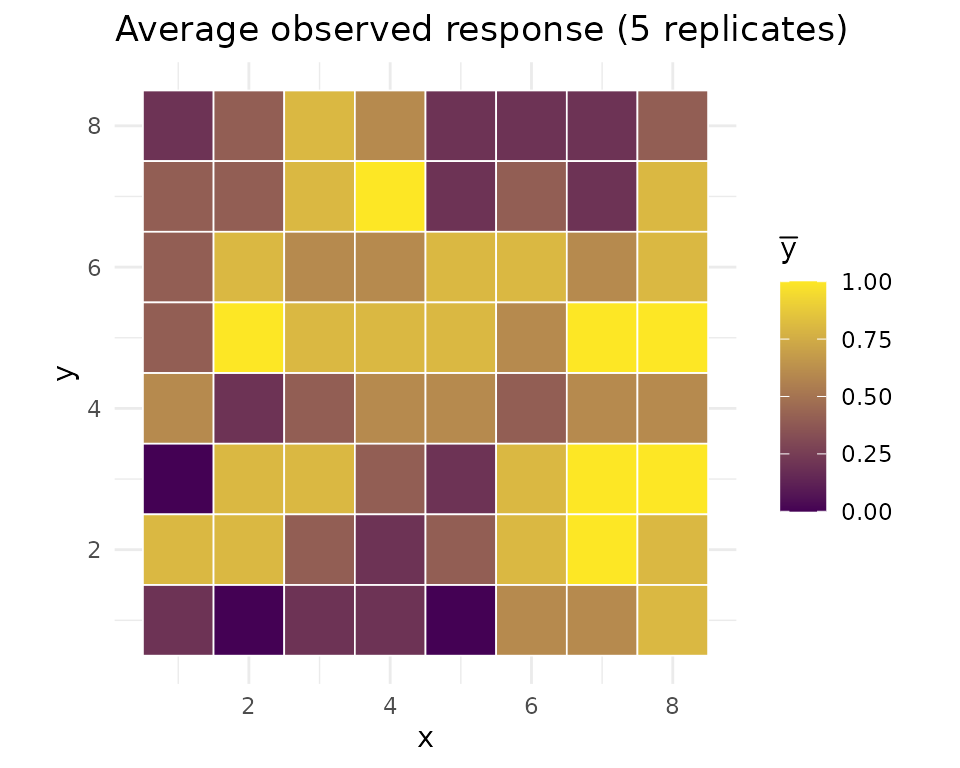

Fit the model:

``` r
model_b <- mdgm_model(nug, dag_type = "spanning_tree",
                       n_colors = 2L, emission = "bernoulli")

result_b <- mcmc(model_b, y = y_bern,
                 z_init = sample(0:1, n, replace = TRUE),
                 psi_init = 0.5,
                 theta_init = c(0.3, 0.7),
                 n_iter = 5000L,
                 psi_tune = 1.0,
                 seed = 42L,
                 nug = nug)

result_b$summary(burnin = 1000L)
#> MDGM MCMC Results
#>   Vertices: 64, Colors: 2
#>   Iterations: 5000 (burnin: 1000)
#>   Psi acceptance rate: 0.390
#>   Psi posterior mean: 1.5658 (sd: 0.6204)
#>   Emission type: bernoulli
#>   p_1 posterior mean: 0.3097 (sd: 0.0550)
#>   p_2 posterior mean: 0.7461 (sd: 0.0425)
#>   Diagnostics:
#>     psi — R-hat: 0.9998, ESS: 204
#>     p_1 — R-hat: 0.9998, ESS: 640
#>     p_2 — R-hat: 1.0022, ESS: 599
```

### Posterior trace plots

``` r
psi_df_b <- data.frame(iteration = seq_along(result_b$psi()), psi = result_b$psi())
ggplot(psi_df_b, aes(iteration, psi)) +
  geom_line(alpha = 0.6, linewidth = 0.3) +
  theme_minimal() +
  labs(title = "Bernoulli: psi trace", x = "Iteration", y = expression(psi))
```

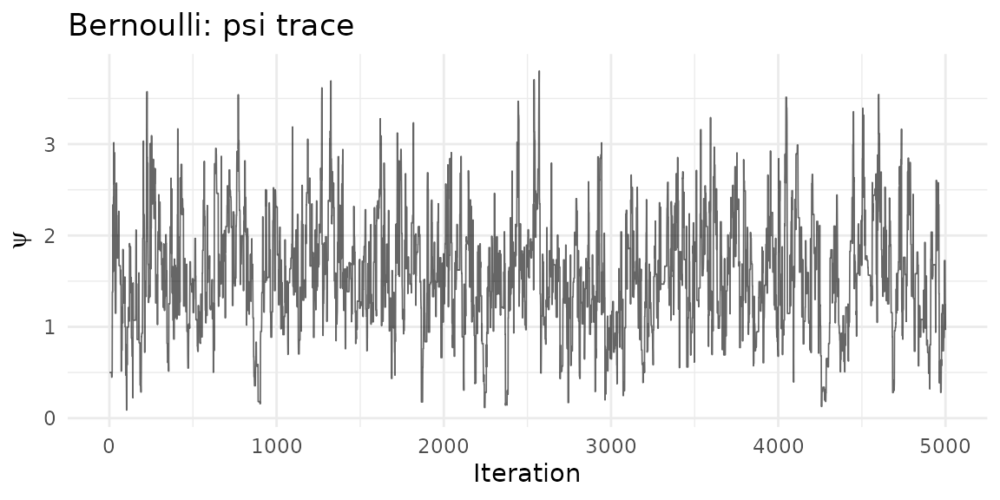

``` r
ep_b <- result_b$emission_params()
n_iter <- ncol(ep_b$p)

p_df <- data.frame(
  iteration = rep(seq_len(n_iter), 2),
  value = c(ep_b$p[1, ], ep_b$p[2, ]),
  parameter = rep(c("p_1", "p_2"), each = n_iter)
)

ggplot(p_df, aes(iteration, value, color = parameter)) +
  geom_line(alpha = 0.5, linewidth = 0.3) +
  geom_hline(yintercept = p_true, linetype = "dashed", alpha = 0.5) +
  theme_minimal() +
  labs(title = "Bernoulli emission: p trace",
       x = "Iteration", y = "Value", color = NULL)
```

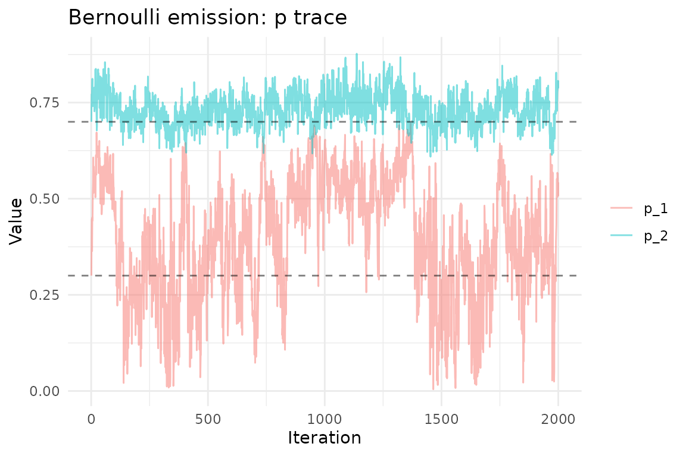

### Edge inclusion probabilities

``` r
result_b$plot(burnin = 1000L, which = "edge_inclusion")
```

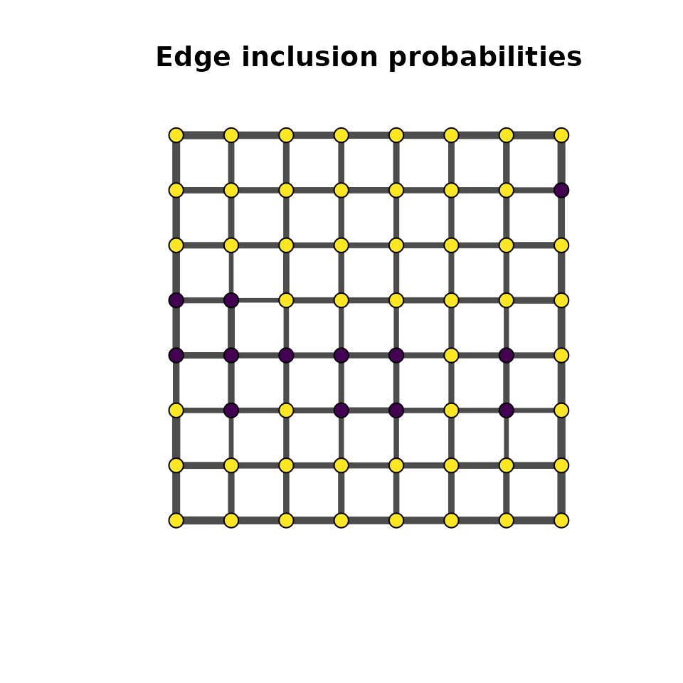

## Gaussian emission

The Gaussian emission models continuous observations. Each observation
is drawn from
$\mathcal{N}\left( \mu_{z_{i}},\sigma_{z_{i}}^{2} \right)$. A single
observation per vertex is sufficient for identifiability.

The priors on $\mu_{k}$ and $\sigma_{k}^{2}$ are independent:
$$\mu_{k} \sim \mathcal{N}\left( \mu_{0},\sigma_{0}^{2} \right),\qquad\sigma_{k}^{2} \sim \text{InverseGamma}\left( \alpha_{0},\beta_{0} \right)$$
where $\sigma_{0}^{2}$ is the prior variance for the mean.

### Example: spatial temperature field

Here we use overlapping emission distributions — the two groups differ
in mean but share similar spread, making classification rely on both the
emission signal and the spatial structure:

``` r
set.seed(2)
mu_true <- c(5, 12)
sigma2_true <- c(9, 9)

# Single observation per vertex
y_gauss <- lapply(seq_len(n), function(i) {
  rnorm(1, mu_true[z_true[i] + 1], sqrt(sigma2_true[z_true[i] + 1]))
})

# Visualize the observations
obs_df <- data.frame(
  x = rep(1:8, 8), y = rep(8:1, each = 8),
  value = vapply(y_gauss, `[`, numeric(1), 1)
)
ggplot(obs_df, aes(x, y, fill = value)) +
  geom_tile(color = "white", linewidth = 0.3) +
  scale_fill_gradient2(low = "#440154", mid = "#21918c", high = "#fde725",
                       midpoint = mean(obs_df$value)) +
  coord_equal() + theme_minimal() +
  labs(title = "Observed temperatures (single obs per vertex)", fill = "y")
```

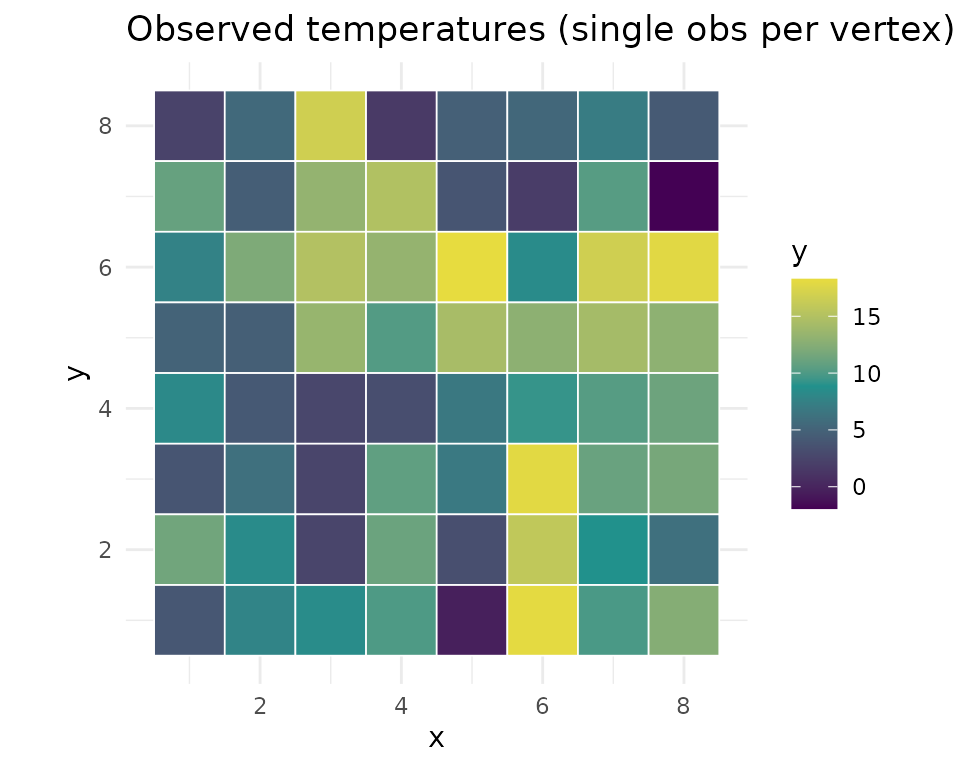

Fit with Gaussian emission:

``` r
model_g <- mdgm_model(nug, dag_type = "spanning_tree",
                       n_colors = 2L, emission = "gaussian")

# theta_init: c(mu_1, mu_2, sigma2_1, sigma2_2)
result_g <- mcmc(model_g, y = y_gauss,
                 z_init = sample(0:1, n, replace = TRUE),
                 psi_init = 0.5,
                 theta_init = c(4, 14, 9, 9),
                 n_iter = 5000L,
                 psi_tune = 1.0,
                 seed = 42L,
                 nug = nug)

result_g$summary(burnin = 1000L)
#> MDGM MCMC Results
#>   Vertices: 64, Colors: 2
#>   Iterations: 5000 (burnin: 1000)
#>   Psi acceptance rate: 0.379
#>   Psi posterior mean: 1.6287 (sd: 0.7845)
#>   Emission type: gaussian
#>   mu_1 posterior mean: 5.5150 (sd: 0.9295)
#>   mu_2 posterior mean: 12.8036 (sd: 1.0608)
#>   sigma2_1 posterior mean: 11.7869 (sd: 4.7116)
#>   sigma2_2 posterior mean: 12.8191 (sd: 5.9121)
#>   Diagnostics:
#>     psi — R-hat: 1.0025, ESS: 102
#>     mu_1 — R-hat: 1.0008, ESS: 255
#>     mu_2 — R-hat: 1.0012, ESS: 283
#>     sigma2_1 — R-hat: 1.0010, ESS: 292
#>     sigma2_2 — R-hat: 1.0001, ESS: 359
```

### Posterior trace plots

``` r
psi_df_g <- data.frame(iteration = seq_along(result_g$psi()), psi = result_g$psi())
ggplot(psi_df_g, aes(iteration, psi)) +
  geom_line(alpha = 0.6, linewidth = 0.3) +
  theme_minimal() +
  labs(title = "Gaussian: psi trace", x = "Iteration", y = expression(psi))
```

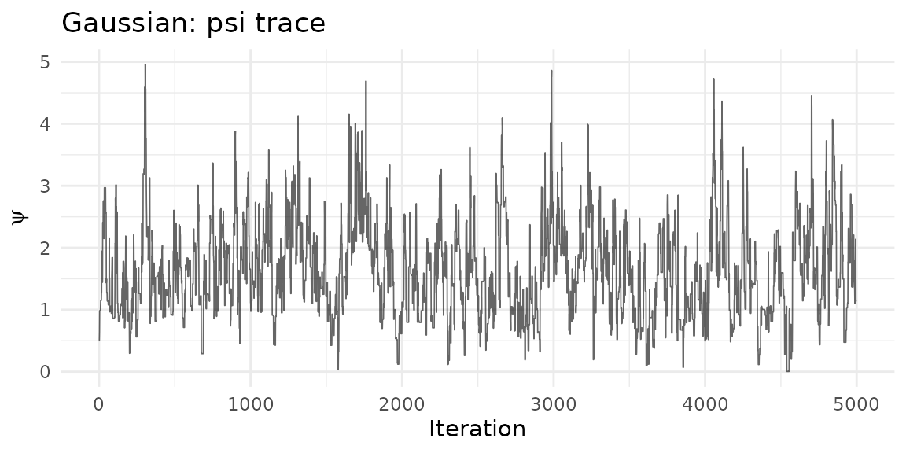

``` r
ep_g <- result_g$emission_params()
n_iter_g <- ncol(ep_g$mu)

mu_df <- data.frame(
  iteration = rep(seq_len(n_iter_g), 2),
  value = c(ep_g$mu[1, ], ep_g$mu[2, ]),
  parameter = rep(c("mu_1", "mu_2"), each = n_iter_g)
)

ggplot(mu_df, aes(iteration, value, color = parameter)) +
  geom_line(alpha = 0.5, linewidth = 0.3) +
  geom_hline(yintercept = mu_true, linetype = "dashed", alpha = 0.5) +
  theme_minimal() +
  labs(title = "Gaussian emission: mu trace",
       x = "Iteration", y = "Value", color = NULL)
```

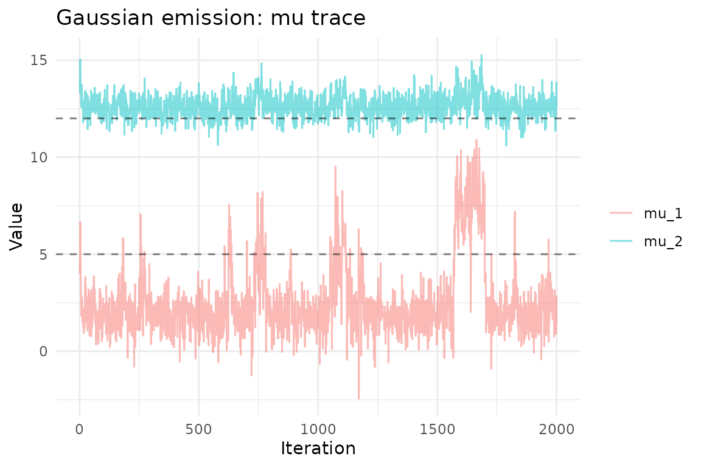

``` r
sigma2_df <- data.frame(
  iteration = rep(seq_len(n_iter_g), 2),
  value = c(ep_g$sigma2[1, ], ep_g$sigma2[2, ]),
  parameter = rep(c("sigma2_1", "sigma2_2"), each = n_iter_g)
)

ggplot(sigma2_df, aes(iteration, value, color = parameter)) +
  geom_line(alpha = 0.5, linewidth = 0.3) +
  geom_hline(yintercept = sigma2_true, linetype = "dashed", alpha = 0.5) +
  theme_minimal() +
  labs(title = "Gaussian emission: sigma2 trace",
       x = "Iteration", y = "Value", color = NULL)
```

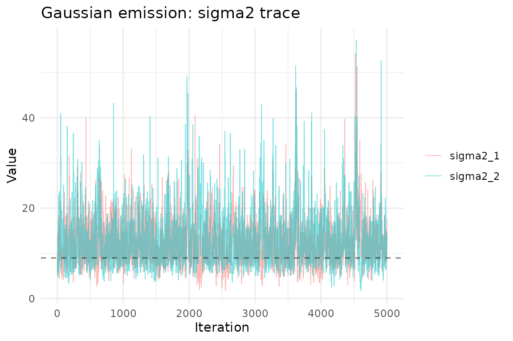

### Edge inclusion probabilities

``` r
result_g$plot(burnin = 1000L, which = "edge_inclusion")
```

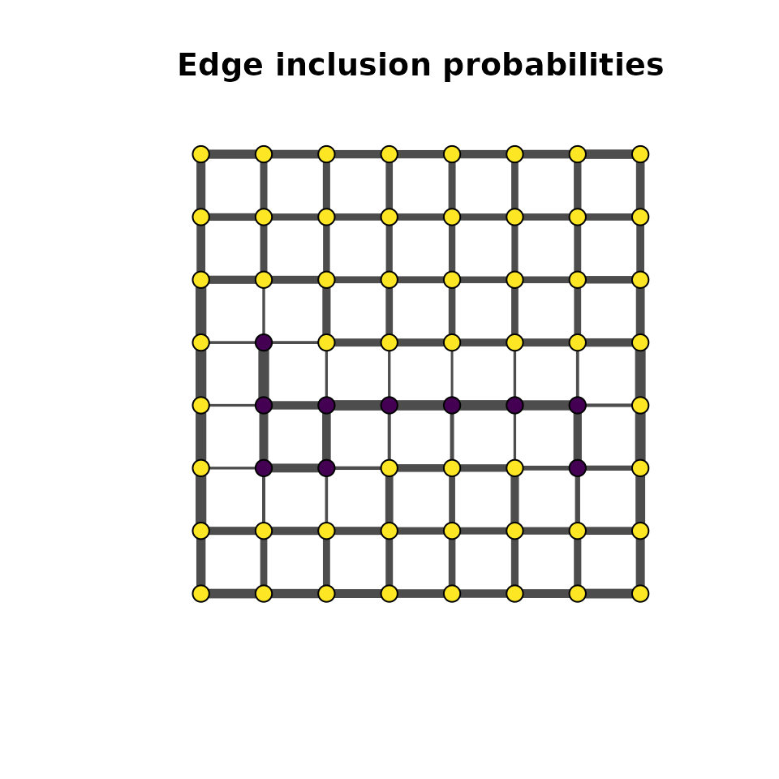

## Poisson emission

The Poisson emission models count data. Each observation is drawn from
$\text{Poisson}\left( \lambda_{z_{i}} \right)$. As with the Gaussian
case, a single observation per vertex is sufficient for identifiability.

The prior is a Gamma distribution:
$\lambda_{k} \sim \text{Gamma}\left( \alpha_{0},\beta_{0} \right)$ with
rate parameterization (mean $= \alpha_{0}/\beta_{0}$).

### Example: spatial species counts

We again use overlapping rates so that the spatial structure contributes
meaningfully to classification:

``` r
set.seed(3)
lambda_true <- c(4, 10)

# Single count per vertex
y_pois <- lapply(seq_len(n), function(i) {
  rpois(1, lambda_true[z_true[i] + 1])
})

obs_df_p <- data.frame(
  x = rep(1:8, 8), y = rep(8:1, each = 8),
  value = vapply(y_pois, `[`, numeric(1), 1)
)
ggplot(obs_df_p, aes(x, y, fill = value)) +
  geom_tile(color = "white", linewidth = 0.3) +
  scale_fill_gradient(low = "#440154", high = "#fde725") +
  coord_equal() + theme_minimal() +
  labs(title = "Observed counts (single obs per vertex)", fill = "y")
```

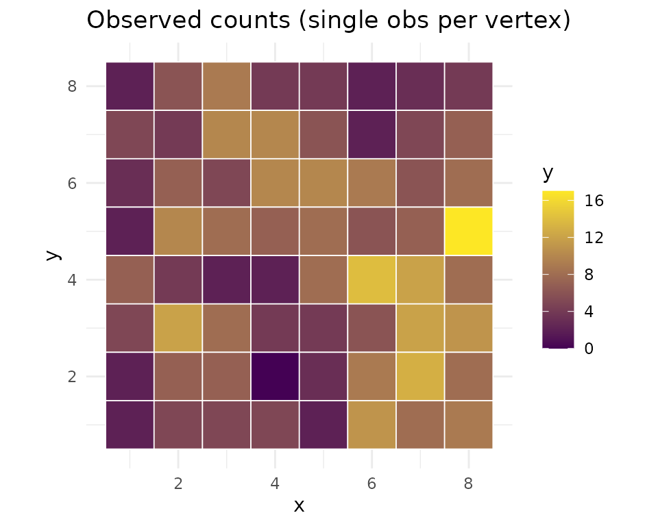

Fit with Poisson emission:

``` r
model_p <- mdgm_model(nug, dag_type = "spanning_tree",
                       n_colors = 2L, emission = "poisson")

result_p <- mcmc(model_p, y = y_pois,
                 z_init = sample(0:1, n, replace = TRUE),
                 psi_init = 0.5,
                 theta_init = c(3, 8),
                 n_iter = 5000L,
                 psi_tune = 1.0,
                 seed = 42L,
                 nug = nug)

result_p$summary(burnin = 1000L)
#> MDGM MCMC Results
#>   Vertices: 64, Colors: 2
#>   Iterations: 5000 (burnin: 1000)
#>   Psi acceptance rate: 0.412
#>   Psi posterior mean: 1.8797 (sd: 0.7296)
#>   Emission type: poisson
#>   lambda_1 posterior mean: 4.0756 (sd: 0.5852)
#>   lambda_2 posterior mean: 9.0175 (sd: 0.7055)
#>   Diagnostics:
#>     psi — R-hat: 1.0000, ESS: 201
#>     lambda_1 — R-hat: 1.0054, ESS: 246
#>     lambda_2 — R-hat: 1.0080, ESS: 390
```

### Posterior trace plots

``` r
psi_df_p <- data.frame(iteration = seq_along(result_p$psi()), psi = result_p$psi())
ggplot(psi_df_p, aes(iteration, psi)) +
  geom_line(alpha = 0.6, linewidth = 0.3) +
  theme_minimal() +
  labs(title = "Poisson: psi trace", x = "Iteration", y = expression(psi))
```

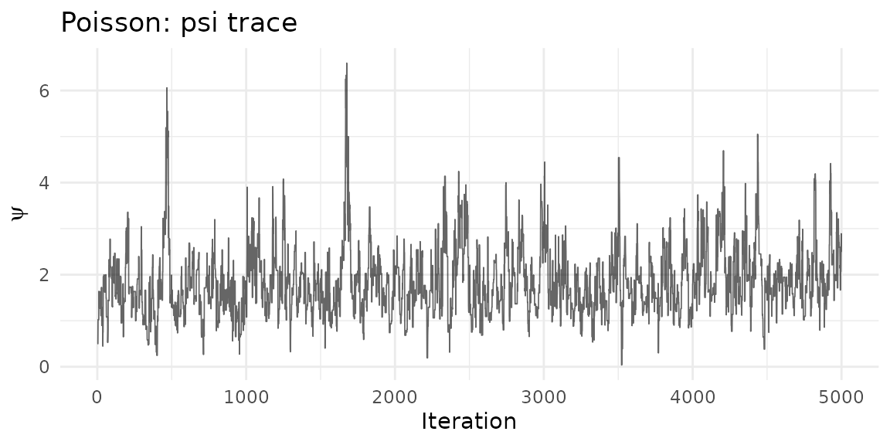

``` r
ep_p <- result_p$emission_params()
n_iter_p <- ncol(ep_p$lambda)

lambda_df <- data.frame(
  iteration = rep(seq_len(n_iter_p), 2),
  value = c(ep_p$lambda[1, ], ep_p$lambda[2, ]),
  parameter = rep(c("lambda_1", "lambda_2"), each = n_iter_p)
)

ggplot(lambda_df, aes(iteration, value, color = parameter)) +
  geom_line(alpha = 0.5, linewidth = 0.3) +
  geom_hline(yintercept = lambda_true, linetype = "dashed", alpha = 0.5) +
  theme_minimal() +
  labs(title = "Poisson emission: lambda trace",
       x = "Iteration", y = "Value", color = NULL)
```

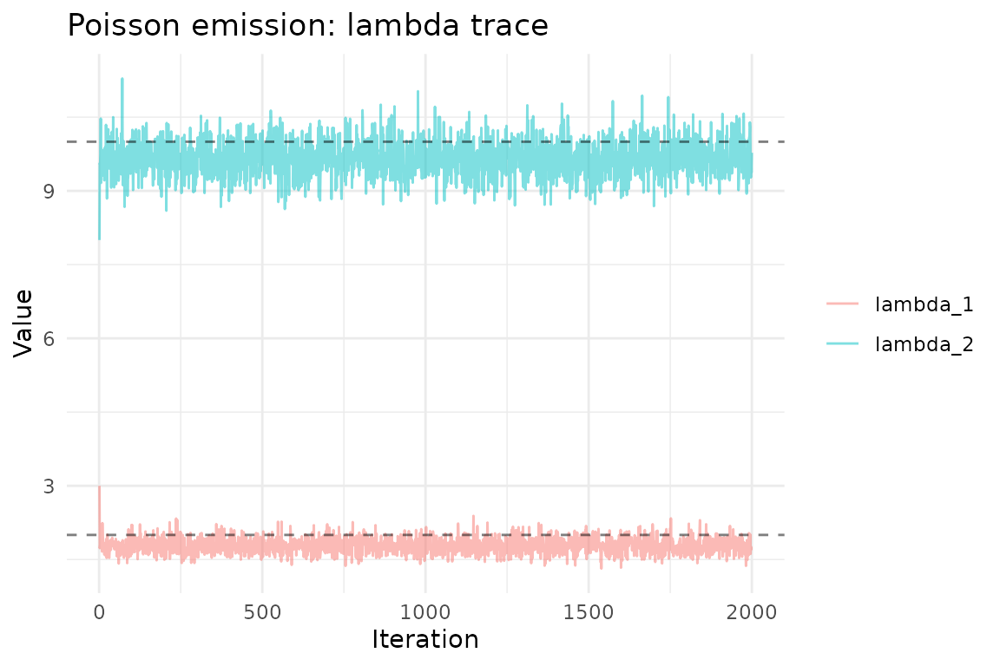

### Edge inclusion probabilities

``` r
result_p$plot(burnin = 1000L, which = "edge_inclusion")
```

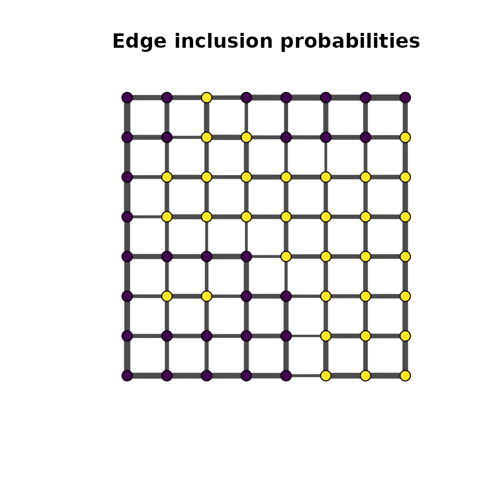

## Comparing latent field recovery

For all three emission types, the posterior mode of the latent field
should recover the true spatial pattern:

``` r
burnin <- 1000L

recover_field <- function(result, burnin) {
  z_post <- result$z()
  z_burn <- z_post[, (burnin + 1):ncol(z_post)]
  apply(z_burn, 1, function(row) {
    tbl <- tabulate(row + 1L, nbins = 2)
    which.max(tbl) - 1L
  })
}

z_mode_b <- recover_field(result_b, burnin)
z_mode_g <- recover_field(result_g, burnin)
z_mode_p <- recover_field(result_p, burnin)

field_df <- data.frame(
  x = rep(rep(1:8, 8), 4),
  y = rep(rep(8:1, each = 8), 4),
  value = c(z_true, z_mode_b, z_mode_g, z_mode_p),
  panel = rep(c("True field", "Bernoulli", "Gaussian", "Poisson"),
              each = n)
)
field_df$panel <- factor(field_df$panel,
                         levels = c("True field", "Bernoulli",
                                    "Gaussian", "Poisson"))

ggplot(field_df, aes(x, y, fill = factor(value))) +
  geom_tile(color = "white", linewidth = 0.2) +
  scale_fill_manual(values = c("0" = "#440154", "1" = "#fde725")) +
  coord_equal() +
  facet_wrap(~panel, nrow = 1) +
  theme_minimal() +
  labs(fill = "z")
```

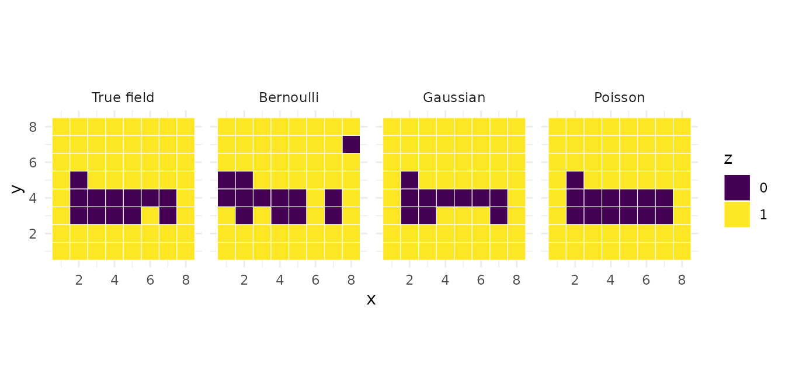

## Choosing an emission family

| Scenario                                             | Recommended emission |
|:-----------------------------------------------------|:---------------------|
| Binary outcomes (presence/absence, success/failure)  | `"bernoulli"`        |
| Continuous measurements (temperature, concentration) | `"gaussian"`         |
| Count data (species counts, event counts)            | `"poisson"`          |

## Prior tuning tips

- **Bernoulli** `c(a, b)`: Use `c(1, 1)` (uniform) as a default.
  Increase `a` and `b` to shrink $p_{k}$ toward 0.5 if you expect weak
  signal.
- **Gaussian** `c(mu_0, sigma2_0, alpha_0, beta_0)`: Set `mu_0` near the
  data mean, `sigma2_0` large (e.g., 10000) for a vague location prior,
  and `alpha_0 = 2`, `beta_0` near the expected variance for a weakly
  informative scale prior.
- **Poisson** `c(alpha_0, beta_0)`: The prior mean is
  `alpha_0 / beta_0`. Use `c(1, 0.1)` for a diffuse prior with mean 10,
  or match to the expected count range.
