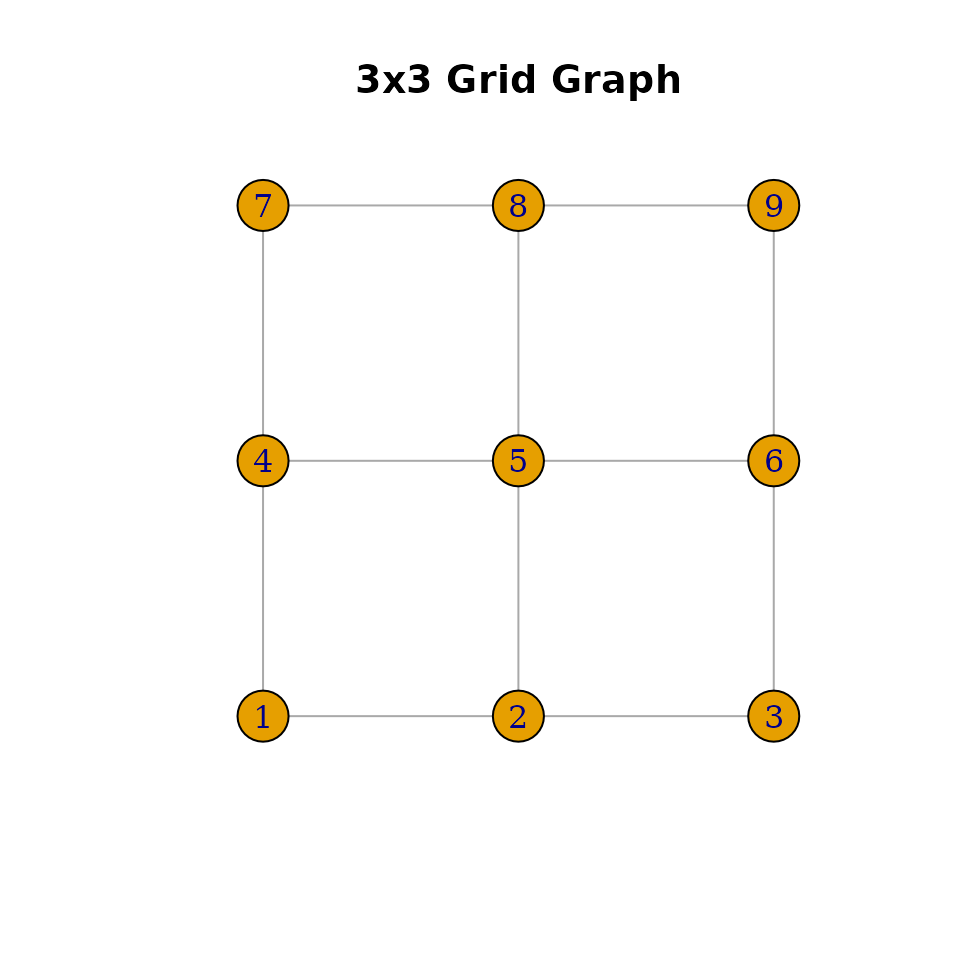

# Working with Undirected Graphs

``` r
library(mdgm)
```

## Overview

The `NaturalUndirectedGraph` is the foundational graph object in mdgm.
It stores an undirected graph in compressed sparse row (CSR) format and
provides methods for querying structure and sampling spanning trees.
Three constructor functions create graphs from different
representations.

## Creating graphs

### From an edge list

Edge lists are matrices (or data frames) with two or three columns. The
first two columns are 1-indexed vertex pairs. Each undirected edge must
appear twice (once per direction). An optional third column gives edge
weights.

``` r
# Triangle: 1 -- 2 -- 3 -- 1
edges <- rbind(
  c(1, 2), c(2, 1),
  c(2, 3), c(3, 2),
  c(1, 3), c(3, 1)
)
g <- nug_from_edge_list(3, edges)
g$nvertices()
#> [1] 3
g$nedges()
#> [1] 3
```

### From an adjacency list

An adjacency list is a list where the i-th element is an integer vector
of vertex i’s neighbors.

``` r
# 4-vertex star: vertex 1 connected to 2, 3, 4
adj <- list(
  c(2L, 3L, 4L),
  1L,
  1L,
  1L
)
g <- nug_from_adj_list(adj)
g$nvertices()
#> [1] 4
g$nedges()
#> [1] 3
```

### From an adjacency matrix

A symmetric matrix where nonzero entries indicate edges. The entry
values are used as edge weights.

``` r
# 3x3 grid (rook adjacency)
n <- 9
A <- matrix(0, n, n)
for (i in 1:n) {
  row_i <- (i - 1) %/% 3 + 1
  col_i <- (i - 1) %% 3 + 1
  for (j in 1:n) {
    row_j <- (j - 1) %/% 3 + 1
    col_j <- (j - 1) %% 3 + 1
    if (abs(row_i - row_j) + abs(col_i - col_j) == 1) {
      A[i, j] <- 1
    }
  }
}
g <- nug_from_adj_mat(A, seed = 123L)
g$nvertices()
#> [1] 9
g$nedges()
#> [1] 12
```

## Querying graph structure

``` r
g$nvertices()
#> [1] 9
g$nedges()
#> [1] 12

# Neighbors of vertex 5 (center of 3x3 grid) — should be 2, 4, 6, 8
sort(g$neighbors(5))
#> [1] 2 4 6 8
```

## Sampling spanning trees

Spanning trees are sampled uniformly (or with edge weights) using
Wilson’s algorithm, Aldous-Broder, or the fast-forward hybrid method.

``` r
# Sample with Wilson's algorithm (default)
tree <- g$sample_spanning_tree("wilson")
```

Available methods:

- `"wilson"` — Wilson’s algorithm using loop-erased random walks.
  Efficient for most graphs.
- `"aldous_broder"` — Aldous-Broder algorithm using a simple random
  walk. Simpler but slower for large graphs.
- `"fast_forward"` — Hybrid method that switches between random walk and
  loop-erased walk.

## Visualization with igraph

If the igraph package is installed, you can convert and plot the graph.

``` r
library(igraph)
#> 
#> Attaching package: 'igraph'
#> The following objects are masked from 'package:stats':
#> 
#>     decompose, spectrum
#> The following object is masked from 'package:base':
#> 
#>     union

# Convert adjacency matrix to igraph
ig <- graph_from_adjacency_matrix(A, mode = "undirected")

# Layout as grid
coords <- cbind((1:n - 1) %% 3, (1:n - 1) %/% 3)
plot(ig, layout = coords, vertex.size = 20, vertex.label = 1:n,
     main = "3x3 Grid Graph")
```


