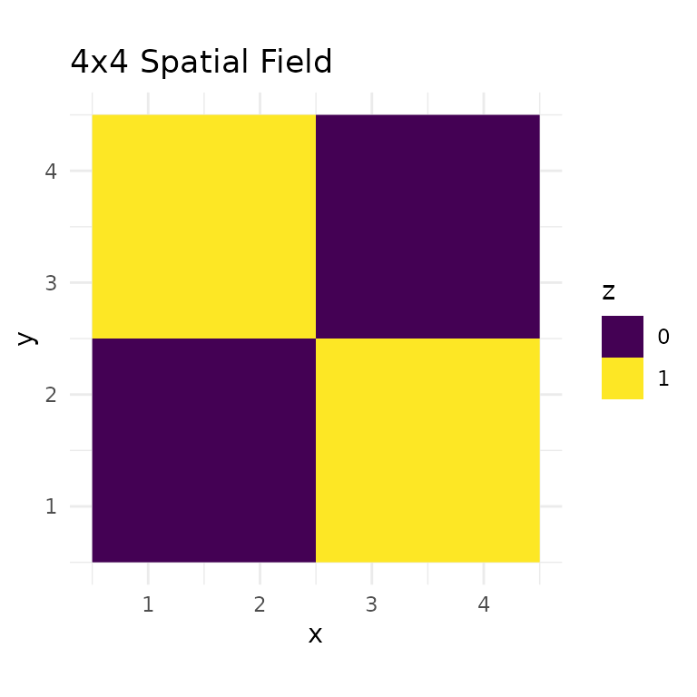
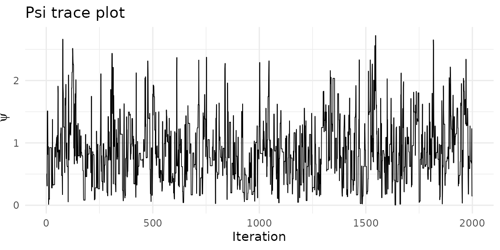
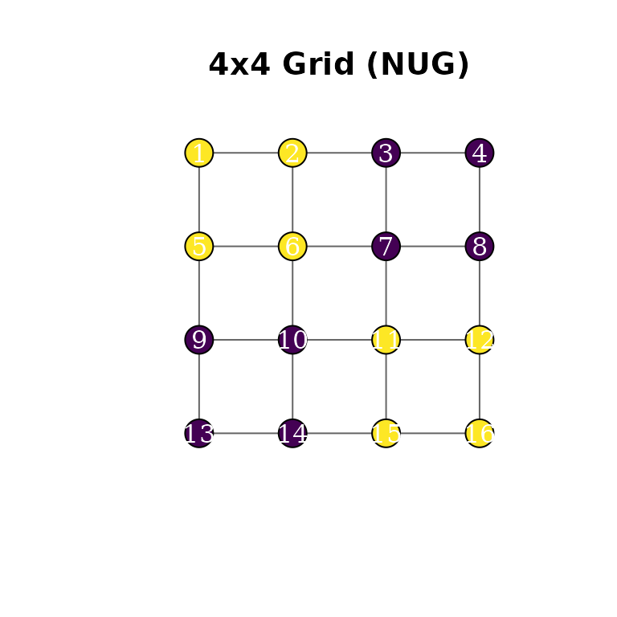
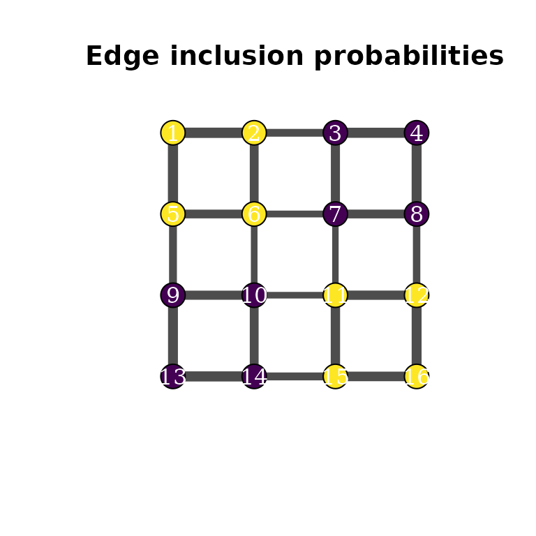

# Getting Started with mdgm

``` r
library(mdgm)
library(ggplot2)
```

## What is mdgm?

The **mdgm** package implements Bayesian inference for discrete spatial
random fields using **Mixtures of Directed Graphical Models**. Like a
Markov random field (MRF), the MDGM takes an undirected graph as input
to represent spatial structure. However, instead of specifying a single
joint distribution with an intractable normalizing constant, the MDGM
defines a mixture over directed acyclic graphs (DAGs) compatible with
the undirected graph. Each DAG admits an efficient factorization,
avoiding the computational burden of the MRF partition function while
providing valid probabilistic inference.

The approach is described in:

> Carter, J. B. and Calder, C. A. (2024). Mixture of Directed Graphical
> Models for Discrete Spatial Random Fields.
> [arXiv:2406.15700](https://arxiv.org/abs/2406.15700)

## Building a graph

Create a 4x4 grid graph with rook adjacency using
[`nug_from_grid()`](https://jbcart.github.io/mdgm/reference/nug_from_grid.md):

``` r
nug <- nug_from_grid(4, 4, seed = 42L)
nug$nvertices()
#> [1] 16
nug$nedges()
#> [1] 24
```

Graphs can also be constructed from an adjacency matrix, edge list, or
adjacency list — see the [Working with Undirected
Graphs](https://jbcart.github.io/mdgm/articles/graph-construction.md)
vignette.

## Fitting a standalone model

In a standalone model, the spatial field $z$ is observed directly — no
emission distribution is needed. Here we fit a spanning-tree MDGM to a
deterministic checkerboard pattern on the 4x4 grid:

``` r
z <- c(1L, 1L, 0L, 0L,
       1L, 1L, 0L, 0L,
       0L, 0L, 1L, 1L,
       0L, 0L, 1L, 1L)

model <- mdgm_model(nug, dag_type = "spanning_tree")

result <- mcmc(model, z_init = z, psi_init = 0.5,
               n_iter = 2000L, psi_tune = 1.0, seed = 42L)
result$summary()
#> MDGM MCMC Results
#>   Vertices: 16, Colors: 2
#>   Iterations: 2000 (burnin: 0)
#>   Psi acceptance rate: 0.471
#>   Psi posterior mean: 0.8641 (sd: 0.5137)
#>   Psi R-hat: 1.0052, ESS: 228
```

Visualize the spatial field as a raster:

``` r
grid_df <- data.frame(
  x = rep(1:4, times = 4),
  y = rep(4:1, each = 4),
  z = factor(z)
)

ggplot(grid_df, aes(x, y, fill = z)) +
  geom_raster() +
  scale_fill_manual(values = c("0" = "#440154", "1" = "#fde725")) +
  coord_equal() +
  theme_minimal() +
  labs(title = "4x4 Spatial Field", fill = "z")
```



## Posterior diagnostics

Trace plot for the spatial dependence parameter $\psi$:

``` r
psi_df <- data.frame(iteration = seq_along(result$psi()), psi = result$psi())

ggplot(psi_df, aes(iteration, psi)) +
  geom_line(linewidth = 0.3) +
  theme_minimal() +
  labs(x = "Iteration", y = expression(psi), title = "Psi trace plot")
```



Acceptance rates:

``` r
result$acceptance_rates()
#>       psi     graph 
#> 0.4712356 0.0000000
```

## Visualizing graph structure with igraph

The [igraph](https://r.igraph.org/) package (suggested, not required)
can plot the neighborhood graph:

``` r
library(igraph)
#> 
#> Attaching package: 'igraph'
#> The following objects are masked from 'package:stats':
#> 
#>     decompose, spectrum
#> The following object is masked from 'package:base':
#> 
#>     union

# Build igraph object from the NUG edge structure
n <- nug$nvertices()
el <- do.call(rbind, lapply(1:n, function(v) {
  nbrs <- nug$neighbors(v)
  nbrs <- nbrs[nbrs > v]
  if (length(nbrs) == 0) return(NULL)
  cbind(v, nbrs)
}))
g <- graph_from_edgelist(el, directed = FALSE)

# Grid layout
coords <- cbind((seq_len(n) - 1) %% 4 + 1, 4 - (seq_len(n) - 1) %/% 4)

plot(g, layout = coords, vertex.size = 20, vertex.label = 1:n,
     vertex.color = c("#440154", "#fde725")[z + 1],
     vertex.label.color = "white", edge.color = "grey40",
     main = "4x4 Grid (NUG)")
```



## Edge inclusion probabilities

The `edge_inclusion_probs()` method counts how often each undirected
edge appears in the posterior spanning-tree samples. We can use these
proportions to scale edge widths:

``` r
eip <- result$edge_inclusion_probs(nug, burnin = 200L)
head(eip[order(-eip$prob), ])
#>    vertex1 vertex2      prob
#> 1        1       2 0.7388889
#> 2        1       5 0.7261111
#> 22      13      14 0.7255556
#> 5        3       4 0.7238889
#> 7        4       8 0.7127778
#> 21      12      16 0.7105556

# Match edge inclusion probs to igraph edge ordering
edge_probs <- numeric(ecount(g))
for (i in seq_len(nrow(eip))) {
  eid <- get.edge.ids(g, c(eip$vertex1[i], eip$vertex2[i]))
  edge_probs[eid] <- eip$prob[i]
}
#> Warning: `get.edge.ids()` was deprecated in igraph 2.1.0.
#> ℹ Please use `get_edge_ids()` instead.
#> This warning is displayed once per session.
#> Call `lifecycle::last_lifecycle_warnings()` to see where this warning was
#> generated.

plot(g, layout = coords, vertex.size = 20, vertex.label = 1:n,
     vertex.color = c("#440154", "#fde725")[z + 1],
     vertex.label.color = "white",
     edge.width = edge_probs * 10,
     edge.color = "grey30",
     main = "Edge inclusion probabilities")
```



Edges between same-colored vertices appear more frequently in the
posterior spanning trees, reflecting the spatial dependence captured by
$\psi$.

## Fitting a hierarchical model

In a hierarchical model, $z$ is a latent field and observations are
generated through an emission distribution. Here we use a Bernoulli
emission:

``` r
model_h <- mdgm_model(nug, dag_type = "spanning_tree", n_colors = 2L,
                       emission = "bernoulli")

set.seed(1)
y <- lapply(1:n, function(i) rbinom(5, 1, ifelse(i <= 8, 0.2, 0.8)))

result_h <- mcmc(model_h, y = y, z_init = rep(0:1, each = 8), psi_init = 0.5,
                 eta_init = c(0.3, 0.7), n_iter = 500L, seed = 42L)
result_h$summary()
#> MDGM MCMC Results
#>   Vertices: 16, Colors: 2
#>   Iterations: 500 (burnin: 0)
#>   Psi acceptance rate: 0.938
#>   Psi posterior mean: 0.9437 (sd: 0.5550)
#>   Emission type: bernoulli
#>   eta_1 posterior mean: 0.1992 (sd: 0.0621)
#>   eta_2 posterior mean: 0.8088 (sd: 0.0700)
#>   Psi R-hat: 2.2812, ESS: 3
```

## Next steps

- **[Working with Undirected
  Graphs](https://jbcart.github.io/mdgm/articles/graph-construction.md)**
  — Graph constructors, querying structure, and sampling spanning trees.
- **[MDGM Model
  Specification](https://jbcart.github.io/mdgm/articles/mdgm-models.md)**
  — DAG types, the spatial field model, emission distributions, and MCMC
  details.
- **[Emission
  Models](https://jbcart.github.io/mdgm/articles/emission-models.md)** —
  Worked examples for Bernoulli, Gaussian, and Poisson emission
  distributions.
